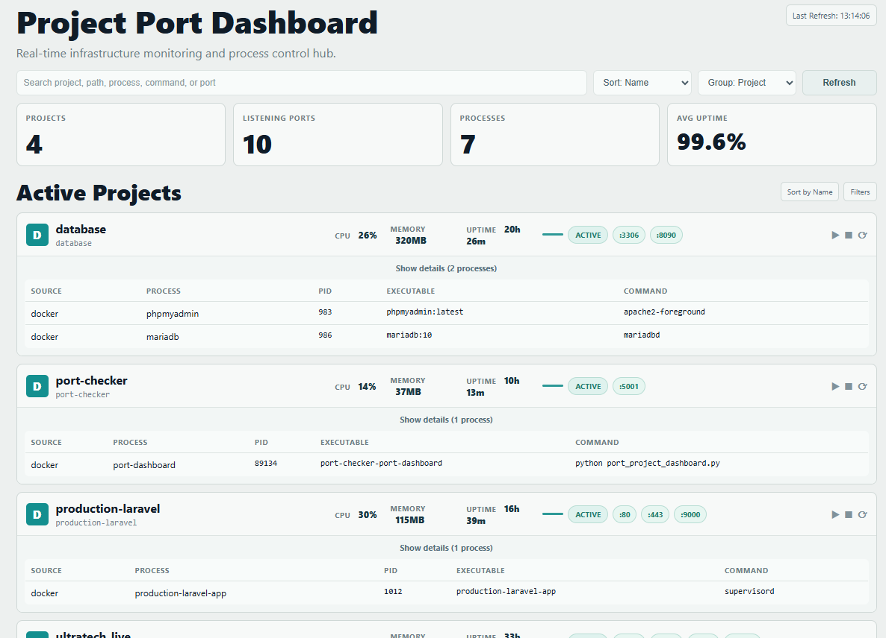

# Port Checker Dashboard

A Flask dashboard for monitoring Docker container service ports and runtime health.

By default in this repository (`docker-compose.yml`), it runs in **Docker-only mode** (`PORT_DASHBOARD_MODE=docker`), so it tracks containers from the Docker Engine API, not general host OS processes.
It currently runs in **monitor-only mode** with actions disabled (`PORT_DASHBOARD_ENABLE_ACTIONS=0`).

## UI Preview



## What It Shows

- Docker containers (running and stopped) grouped by project/service context
- Published/listening container ports exposed through Docker networking
- Container status (`ACTIVE` / `NOT RUNNING` / `PARTIAL`)
- Container metadata (name, image, command, pid when available)
- Real-time memory totals in the dashboard
- System health values:
  - Core services: running/total container count
  - Storage volume: live disk free %
  - Memory usage: summed tracked container/process memory
  - API latency: live request round-trip time from browser

## Scope Clarification

- With current compose defaults, this project is **not** a full host-wide port scanner.
- It is focused on **Docker workloads** visible through Docker API access (`/var/run/docker.sock`).
- Host process/host port scanning exists in code as hybrid mode, but is disabled in this repo’s compose configuration.

## Tech Stack

- Python 3
- Flask
- psutil
- Docker SDK for Python

## Prerequisites

- Docker Desktop or Docker Engine
- Docker Compose v2

## Get the Code

From your terminal, clone the repository and move into it:

```bash
git clone https://github.com/kdeelz69/port-checker.git
cd port-checker
```

## Run with Docker Compose

```bash
cp .env.example .env
# Edit .env with strong values before starting
docker compose up --build -d
```

Open:

- http://localhost:5001

To stop:

```bash
docker compose down
```

## Run with Docker (Without Compose)

```bash
docker build -t port-checker .
docker run --rm -p 5001:5001 --name port-checker port-checker
```

## Environment Variables

- `PORT_DASHBOARD_HOST` (default: `0.0.0.0`)
- `PORT_DASHBOARD_PORT` (default: `5001`)
- `PORT_DASHBOARD_MODE` (`docker` for container-only, `hybrid` for host + docker)
- `INCLUDE_DOCKER_CONTAINERS` (default: `1`)
- `PORT_DASHBOARD_ENABLE_ACTIONS` (default: `0`; set to `1` to allow start/stop/restart API)
- `PORT_DASHBOARD_API_TOKEN` (optional; if set, requests must include `X-API-Token` or `Authorization: Bearer`)
- `PORT_DASHBOARD_BASIC_AUTH_USER` + `PORT_DASHBOARD_BASIC_AUTH_PASS` (optional alternative auth mode)
- `PORT_DASHBOARD_SECRET_KEY` (required for secure login sessions; set a long random value in production)
- `PORT_DASHBOARD_COOKIE_SECURE` (default: `1`; set `0` only for local HTTP testing, keep `1` on HTTPS)
- `PORT_DASHBOARD_ALLOWED_IPS` (optional comma-separated IP/CIDR allowlist, e.g. `127.0.0.1,10.0.0.0/8`)
- `PORT_DASHBOARD_ALLOW_ANONYMOUS` (default: `0`; when `1`, allows access without configured login credentials)
- `PORT_DASHBOARD_LOGIN_MAX_ATTEMPTS` (default: `8`)
- `PORT_DASHBOARD_LOGIN_WINDOW_SEC` (default: `300`)

## Security Notes (Important)

- This app can control Docker containers when actions are enabled and Docker socket is mounted.
- In this repo's current `.env`, actions are OFF (`PORT_DASHBOARD_ENABLE_ACTIONS=0`).
- Only set `PORT_DASHBOARD_ENABLE_ACTIONS=1` when you intentionally need container start/stop/restart controls.
- Keep it behind a reverse proxy/VPN or private network.
- By default in this repo, published port is bound to localhost (`127.0.0.1:5001`) to reduce accidental exposure.
- Before exposing beyond localhost, configure at least one auth mode (`PORT_DASHBOARD_API_TOKEN` or Basic Auth).
- Browser access now uses `/login` form UI (instead of browser Basic Auth popup).
- `PORT_DASHBOARD_SECRET_KEY` is mandatory and must be strong (min 32 chars) or app startup will fail.
- Docker socket mount is enabled in `docker-compose.yml` for container visibility/control and should be treated as high-risk.

## Platform Notes (Important)

This app depends on `psutil` to inspect OS processes and listening ports.

- Docker on Linux: `psutil` sees the container namespace, but this project also queries Docker Engine (via `/var/run/docker.sock`) to list other running containers and their ports.
- Docker Desktop on Windows/macOS: host OS process visibility is still limited, but container port visibility works when Docker socket is mounted.

## Troubleshooting

- `ImportError: psutil`:
  - Rebuild the image: `docker compose up --build`
- Port `5001` already in use:
  - Change mapped port in `docker-compose.yml` (for example `5050:5001`).
- Empty or partial process list:
  - Check Docker socket mount and ensure other containers are running.

## Project Structure

- `port_project_dashboard.py`: Flask app and embedded dashboard UI
- `requirements.txt`: Python dependencies
- `Dockerfile`: container image definition
- `docker-compose.yml`: local container orchestration

## License


